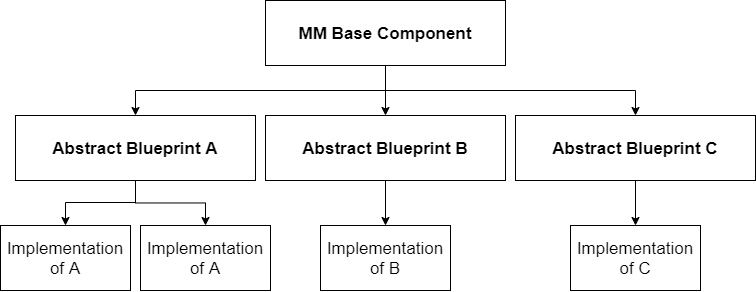
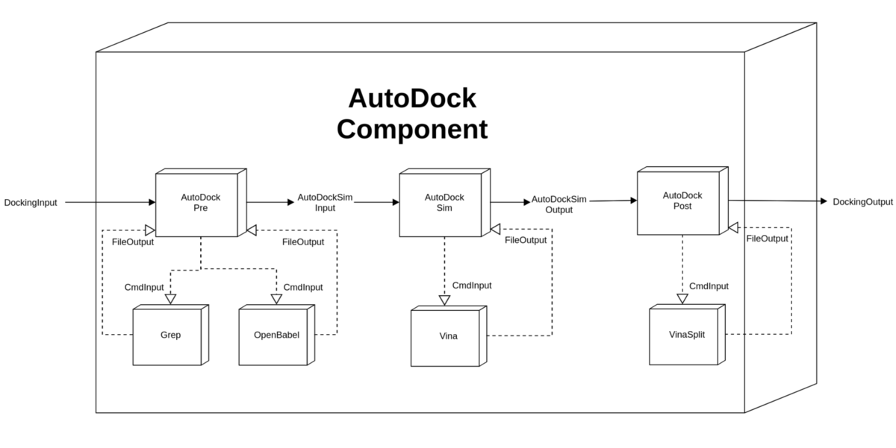

# What is MMComponents?
The Molecular Mechanics Components (MMComponents) project is a standard for input and output of programs for defining the scientific and computational stages of classical MM pipelines specifying the I/O, but the leaving the implementation up to a developer or user. We define the "what" of the scientific stages without restricting the "how". We define only the input and output the implementation must conform to so that end-users can swap out different implementations with minimal effort in their existing pipelines, or workflow tools of their preference. The components themselves allow users to speed up most of their pipelines by integrating the expertise from component developers, letting them focus on the parts of their research they are experts in.

This allows reproducibility from statically defined and shareable components, experimentation to find a quality series of components for specific problems and systems, and a mechanism for quality methodological assessment rather than scientist expertise.

<p align="center">
    
</p>

We construct an abstract Base Component that is inherited by all MMComponent blueprints. For each scientific problem, a blueprint is defined that specifies what the component seeks to achieve, along with the necessary inputs and outputs. This component is implemented to satisfy the scientific problem by any number of users/developers.
 
# Molecular Docking
Docking is used to determine the optimal binding modes of a ligand-receptor system. A ligand is typically a small (e.g. organic) molecule that binds to a macromolecular receptor such as a protein. A docking simulation estimates the strength of binding (or the "score") in the vicinity of the receptor's binding site. Each score corresponds to the 3D conformation and orientation (or "pose") of the ligand relative to the receptor.


Applications of docking include:

- Virtual screening (hit identification)
- Drug discovery (lead optimization)
- Binding site identification (blind docking)
- Protein-protein interactions
- Enzymatic reaction mechanisms
- Protein engineering

# Example: AutoDock Component



```python
from models.components.docking.input import DockingInput

from components.implementation.autodock_component import AutoDockComponent

dockingIn = DockingInput(Ligand, Receptor)

dockingOut = AutoDockComponent.compute(dockingIn)

scores, poses = dockingOut.scores, dockingOut.poses
```
